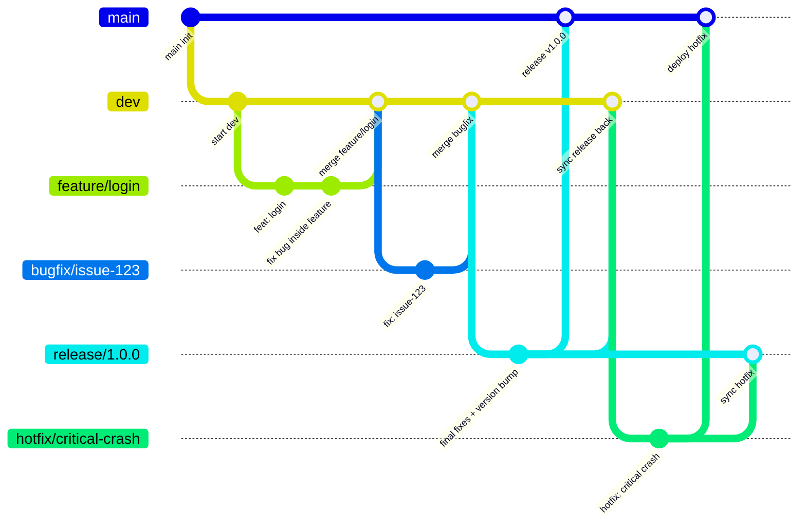

## 🧭 Repository Structure
<!--STRUCTURE_START-->

*(auto)*
<!--STRUCTURE_END-->

---

## 🛠 Branch Workflows

This repository follows the **GitFlow** branching model.

### 🏗 Branch Structure
`main` → Production-ready code, always stable and deployable.

`dev` → Integration branch for new features and bug fixes; base for upcoming releases.

`feature/*` → For developing new features. Branch off from `dev`, merge back into `dev`.

`bugfix/*` → For fixing reported issues (non-critical, not blocking production). Must originate from a tracked issue/ticket. Branch off from `dev`, merge back into `dev`.

`release/*` → For preparing a release (final bug fixes, docs, version bump). Branch off from `dev`, merged into both `main` and `dev`.

`hotfix/*` → For urgent/critical fixes in production. Branch off from `main`, merged into both `main` and the latest `release/*` (or `dev` if no active `release`).

### 🔄 Workflow Summary
#### ✨ Feature Development
Create a `feature/*` branch from `dev`.
Used for new functionality.
Merge back into `dev`.
If a bug appears during feature development, it is resolved inside the same `feature/*` (not a separate `bugfix/*`).

#### 🐞 Bug Fixing
Create a `bugfix/*` from `dev` to address a known issue (originating from an Issue Tracker).
Merge back into `dev` after review.

#### 🚀 Release Preparation
When `dev` is stable and ready for release, create a `release/*`.
Apply final bug fixes, documentation, version updates.
Merge into `main` for production, and back into `dev` for synchronization.

#### 🔥 Hotfix for Production
For critical issues in production, create a `hotfix/*` from `main`.
After fixing:
Merge into `main` → deploy immediately.
Merge into the active `release/*` (if it exists) or into `dev` directly.

#### 📊 Visual


---

## 📝 Commit Message
#### Conventional Commit
```
<type>(<scope>): <message>
```
#### Type & Scope
- `feat` → add feature
- `fix` → bug fix / hot fix
- `docs` → edit documentation
- `style` → change code format/style (does not affect logic)
- `refactor` → edit code but do not add feature, do not fix bug
- `test` → add/edit test
- `chore` → miscellaneous (update dependency, config)

**Scope** as Module

**E.g.**
```
feat(merc): expose callback api
fix(gtw): incorrect payment calculation
docs(root): update README
style(pro): reactive pipeline insteand of imperative code
refactor(fr): optimize structure classes and funtions
test(net): issuer forward
chore(aqr): bump version 1.2.0
```

---

## ⚙️ Ruleset & Conventions
<!--RULESET_START-->
### ⚙️ Detected Rules and Configurations

- 🧩 **EditorConfig** detected
- 🧱 **Gradle project root**
- 🔧 **Custom GitHub Actions** found in `.github/actions`
- ⚙️ **Multi-module Gradle project** setup

*(auto)*
<!--RULESET_END-->

---

## 🚀 Workflows
<!--WORKFLOWS_START-->
### 🚀 CI/CD Workflows
- **Deliver**
  ```yaml
    on:
      push:
      pull_request:
  ```
- **Deploy**
  ```yaml
    on:
      workflow_dispatch:
  ```
- **Develop**
  ```yaml
    on:
      push:
      pull_request:
  ```
- **Overview**
  ```yaml
    on:
      workflow_dispatch:
      push:
      pull_request:
  ```
- **Release**
  ```yaml
    on:
      schedule:
      workflow_dispatch:
  ```
*(auto)*
<!--WORKFLOWS_END-->

---

## ⚖️ License:
This repository is licensed under the **MIT** License

---

## 🧑‍💻 Author:
[William Phan](https://github.com/wliamp)

---

## 📫 Contact:
`phnam230197@gmail.com`

