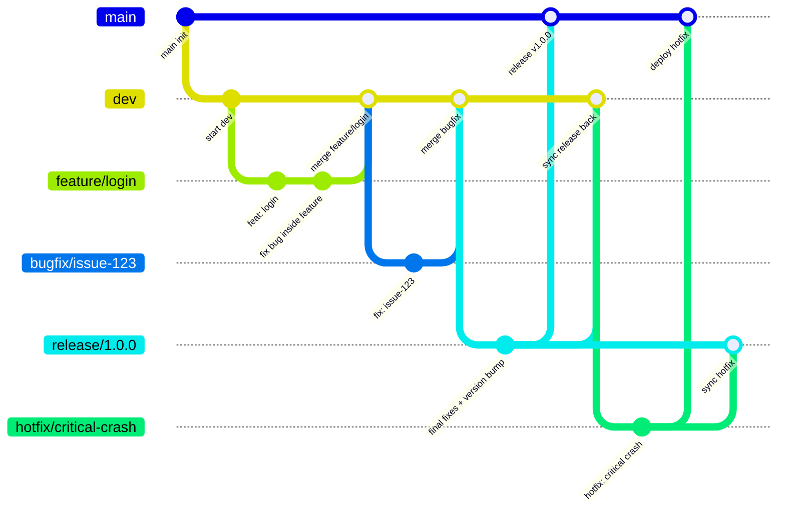

## 🧭 Repository Structure
<!--STRUCTURE_START-->

<!--STRUCTURE_END-->

---

## 🛠 Branch Workflows

This repository follows the **GitFlow** branching model.

### 🏗 Branch Structure
`main` → Production-ready code, always stable and deployable.

`dev` → Integration branch for new features and bug fixes; base for upcoming releases.

`feature/*` → For developing new features. Branch off from `dev`, merge back into `dev`.

`bugfix/*` → For fixing reported issues (non-critical, not blocking production). Must originate from a tracked issue/ticket. Branch off from `dev`, merge back into `dev`.

`release/*` → For preparing a release (final bug fixes, docs, version bump). Branch off from `dev`, merged into both `main` and `dev`.

`hotfix/*` → For urgent/critical fixes in production. Branch off from `main`, merged into both `main` and the latest `release/*` (or `dev` if no active `release`).

### 🔄 Workflow Summary
#### ✨ Feature Development
Create a `feature/*` branch from `dev`.
Used for new functionality.
Merge back into `dev`.
If a bug appears during feature development, it is resolved inside the same `feature/*` (not a separate `bugfix/*`).

#### 🐞 Bug Fixing
Create a `bugfix/*` from `dev` to address a known issue (originating from an Issue Tracker).
Merge back into `dev` after review.

#### 🚀 Release Preparation
When `dev` is stable and ready for release, create a `release/*`.
Apply final bug fixes, documentation, version updates.
Merge into `main` for production, and back into `dev` for synchronization.

#### 🔥 Hotfix for Production
For critical issues in production, create a `hotfix/*` from `main`.
After fixing:
Merge into `main` → deploy immediately.
Merge into the active `release/*` (if it exists) or into `dev` directly.

#### 📊 Visual


---

## 📝 Commit Message
#### Conventional Commit
```
<type>(<scope>): <message>
```
#### Type & Scope
- `feat` → add feature
- `fix` → bug fix / hot fix
- `docs` → edit documentation
- `style` → change code format/style (does not affect logic)
- `refactor` → edit code but do not add feature, do not fix bug
- `test` → add/edit test
- `chore` → miscellaneous (update dependency, config)

**Scope** as Module

**E.g.**
```
feat(merc): expose callback api
fix(gtw): incorrect payment calculation
docs(root): update README
style(pro): reactive pipeline insteand of imperative code
refactor(fr): optimize structure classes and funtions
test(net): issuer forward
chore(aqr): bump version 1.2.0
```

---

## ⚙️ Ruleset & Conventions
<!--RULESET_START-->
### 🛡 Branch Protection Rules (from GitHub API)

#### 🔒 Branch `auto/overview-18457408979`
- No protection rules set

#### 🔒 Branch `auto/overview-18458438980`
- No protection rules set

#### 🔒 Branch `auto/overview-18458641193`
- No protection rules set

#### 🔒 Branch `backup`
- No protection rules set

#### 🔒 Branch `dev`
- No protection rules set

#### 🔒 Branch `main`
- No protection rules set

<!--RULESET_END-->

---

## 🚀 Workflows
<!--WORKFLOWS_START-->
### 📄 GitHub YAML configs (.github/)

- **File:** .github/workflows/deliver.yml / **Name:** Deliver
  - Triggered on: {}
  - Job: deliver (runs on ubuntu-latest)
      * Condition: !contains(vars.EXCLUDE_DELIVER_ACTORS, github.actor)

      * Step: uses → actions/checkout@v4
      * Step: uses → ./.github/actions/deliver
        inputs: {'docker_user': '${{ vars.DOCKERHUB_USER }}', 'docker_repo': '${{ vars.DOCKERHUB_REPO }}', 'docker_token': '${{ secrets.DOCKERHUB_TOKEN }}', 'slack': '${{ secrets.SLACK_WEBHOOK_URL }}'}

- **File:** .github/workflows/deploy.yml / **Name:** Deploy
  - Triggered on: {}
  - Job: delpoy (runs on ubuntu-latest)
      * Condition: github.ref == 'refs/heads/main'
      * Step: uses → actions/checkout@v4
      * Step: uses → ./.github/actions/deploy
        inputs: {'image_repo': '${{ github.event.inputs.repo }}', 'image_ver': '${{ github.event.inputs.ver }}', 'manifests': '${{ vars.K8S_MANIFESTS_BASE }}/${{ github.event.inputs.repo }}', 'image_space': '${{ vars.DOCKERHUB_REPO }}', 'approvers': '${{ vars.INCLUDE_DEPLOY_ACTORS }}', 'staging_cluster': '${{ vars.K8S_STAGING_CLUSTER }}', 'prod_cluster': '${{ vars.K8S_PROD_CLUSTER }}', 'staging_namespace': '${{ vars.K8S_STAGING_NAMESPACE }}', 'prod_namespace': '${{ vars.K8S_PROD_NAMESPACE }}', 'prom': '${{ vars.PROM_PUSH_URL }}', 'grafana': '${{ vars.GRAFANA_URL }}', 'slack': '${{ secrets.SLACK_WEBHOOK_URL }}', 'k8s_config': '${{ secrets.K8S_CONFIG_BASE64 }}', 'grafana_key': '${{ secrets.GRAFANA_ACCOUNT_TOKEN }}'}

- **File:** .github/workflows/release.yml / **Name:** Release
  - Triggered on: {}
  - Job: resolve-version (runs on ubuntu-latest)
      * Step: uses → actions/checkout@v4
      * Step: run → #!/bin/bash; set -euo pipefail; echo "🔍 Scanning repository for Dockerfiles..."; mapfile -t images < <(find . -type f -name 'Dockerfile' -printf '%h\n' | sed 's|^\./||' | sort); if [ ${#images[@]} -eq 0 ]; then;   echo "❌ No Dockerfiles found in repository.";   exit 1; fi; echo "🧾 Found Docker image directories:"; printf ' - %s\n' "${images[@]}"; versions='[]'; for image in "${images[@]}"; do;   echo "🔍 Checking latest version for $image ...";   latest=$(curl -s "https://hub.docker.com/v2/repositories/${DOCKER_REPO}/${image}/tags?page_size=1" \;     | jq -r '.results[0].name' || echo "0.0.0");   if [[ -z "$latest" || "$latest" == "null" ]]; then;     latest="0.0.0";   fi;   echo "➡️ Found latest tag: $latest";   IFS='.' read -r major minor patch <<< "$latest";   major=${major:-0};   minor=${minor:-0};   patch=${patch:-0};   patch=$((patch + 1));   if (( patch > 9 )); then;     patch=0;     minor=$((minor + 1));   fi;   if (( minor > 9 )); then;     minor=0;     major=$((major + 1));   fi;   next="$major.$minor.$patch";   echo "🔢 Next version for $image → $next";   versions=$(jq -c --arg i "$image" --arg v "$next" \;     '. + [{"image":$i,"version":$v}]' <<< "${versions:-[]}"); done; echo "✅ Final version matrix:"; echo "$versions" | jq .; echo "matrix={\"include\":$versions}" >> $GITHUB_OUTPUT; 
  - Job: release (runs on ubuntu-latest)
      * Strategy: {'matrix': '${{ fromJSON(needs.resolve-version.outputs.matrix) }}'}
      * Step: uses → ./.github/actions/release
        inputs: {'image': '${{ matrix.image }}', 'version': '${{ matrix.version }}'}

- **File:** .github/workflows/overview.yml / **Name:** Overview
  - Triggered on: {}
  - Job: overview (runs on ubuntu-latest)
      * Step: uses → actions/checkout@v4
      * Step: uses → actions/setup-python@v4
        inputs: {'python-version': '3.x'}
      * Step: run → pip install pyyaml requests
      * Step: run → bash .github/scripts/overview.sh
      * Step: run → git config user.name "github-actions[bot]"; git config user.email "github-actions[bot]@users.noreply.github.com"; git add README.md; if git diff --cached --quiet; then;   echo "No changes detected in README.md, skipping commit.";   exit 0; fi; git commit -m "auto update repo overview"; 
      * Step: uses → peter-evans/create-pull-request@v6
        inputs: {'token': '${{ secrets.PAT }}', 'branch': 'auto/overview-${{ github.run_id }}', 'base': 'main', 'title': 'Overview', 'body': 'This PR updates README.md with the latest overview:\n\n- 🧭 Repository structure\n- ⚙️ Branch protection rules\n- 🚀 Workflows & actions\n', 'commit-message': 'Auto update repository overview', 'delete-branch': True}

- **File:** .github/workflows/develop.yml / **Name:** Develop
  - Triggered on: {}
  - Job: detect-changes (runs on ubuntu-latest)
      * Condition: !contains(vars.EXCLUDE_DEVELOP_ACTORS, github.actor)

      * Step: uses → actions/checkout@v4
      * Step: run → echo "🔍 Scanning repo for modules..."; find . -mindepth 2 -maxdepth 2 -type f -name "build.gradle*" \;   | sed 's|^\./||; s|/build.gradle.*||' \;   | sort > /tmp/all_modules.txt; jq -R -s -c 'split("\n")[:-1] | map(split("/")) | map({scope:.[0], module:.[1]})' /tmp/all_modules.txt > /tmp/all_modules.json; echo "::notice::Discovered modules:"; cat /tmp/all_modules.json | jq .; echo "all_modules=$(cat /tmp/all_modules.json)" >> $GITHUB_OUTPUT; 
      * Step: run → base=$(git merge-base origin/dev HEAD || echo ""); if [[ -z "$base" ]]; then;   echo "::warning::No base branch found → assuming full build";   echo "level=root" >> $GITHUB_OUTPUT;   exit 0; fi; git diff --name-only "$base" HEAD > /tmp/changed.txt; echo "::notice::Changed files:"; sed 's/^/  - /' /tmp/changed.txt || true; if grep -qE '^[^/]+$' /tmp/changed.txt; then;   echo "level=root" >> $GITHUB_OUTPUT;   echo "::warning::Root-level change detected → full CI mode"; else;   echo "level=module" >> $GITHUB_OUTPUT; fi; 
      * Step: run → level="${{ steps.detect.outputs.level }}"; all=$(cat /tmp/all_modules.json); if [[ "$level" == "root" ]]; then;   echo "::notice::Root-level change → use full matrix";   matrix="$all"; else;   echo "::notice::Analyzing changed scopes/modules...";   awk -F'/' '{print $1}' /tmp/changed.txt | sort -u > /tmp/scopes.txt;   awk -F'/' '{print $1"/"$2}' /tmp/changed.txt | sort -u > /tmp/paths.txt;   matrix=$(jq -c \;     --argjson all "$all" \;     --argjson scopes "$(jq -R -s 'split("\n")[:-1]' < /tmp/scopes.txt)" \;     --argjson mods "$(jq -R -s 'split("\n")[:-1]' < /tmp/paths.txt)" ';     [ $all[] | select(;         ($scopes | index(.scope));         or;         ($mods | index((.scope + "/" + .module)));       ) ]');   if [[ "$(jq length <<< "$matrix")" -eq 0 ]]; then;     echo "::warning::No module match found → full build";     matrix="$all";   fi; fi; echo "matrix=$matrix" >> $GITHUB_OUTPUT; echo "::notice::Final build matrix:"; echo "$matrix" | jq .; 
      * Step: run → rm -f /tmp/*.txt /tmp/*.json || true; echo "::notice::Temporary files cleaned."; 
  - Job: develop (runs on ubuntu-latest)
      * Strategy: {'fail-fast': False, 'matrix': {'include': '${{ fromJSON(needs.detect-changes.outputs.matrix) }}'}}
      * Step: uses → actions/checkout@v4
      * Step: uses → ./.github/actions/develop
        inputs: {'scope': '${{ matrix.scope }}', 'module': '${{ matrix.module }}'}

- **File:** .github/actions/release/action.yml / **Name:** .github/actions/release/action.yml
  - Triggered on: {}

- **File:** .github/actions/develop/action.yml / **Name:** .github/actions/develop/action.yml
  - Triggered on: {}

- **File:** .github/actions/deploy/action.yml / **Name:** .github/actions/deploy/action.yml
  - Triggered on: {}

- **File:** .github/actions/deliver/action.yml / **Name:** .github/actions/deliver/action.yml
  - Triggered on: {}

<!--WORKFLOWS_END-->

---

## ⚖️ License:
This repository is licensed under the **MIT** License

---

## 🧑‍💻 Author:
[William Phan](https://github.com/wliamp)

---

## 📫 Contact:
`phnam230197@gmail.com`

