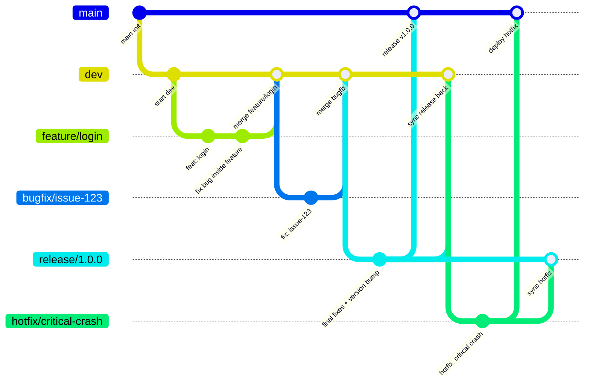
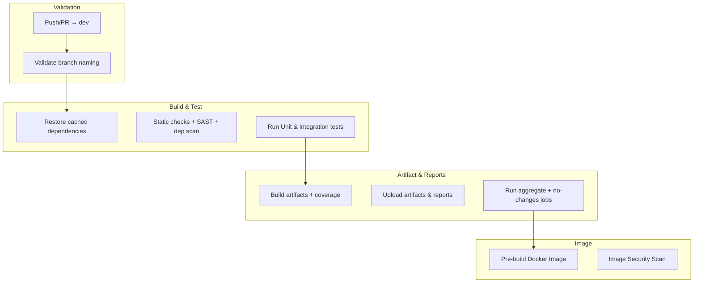
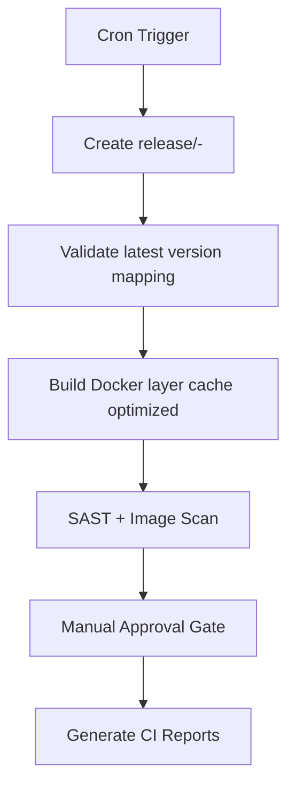
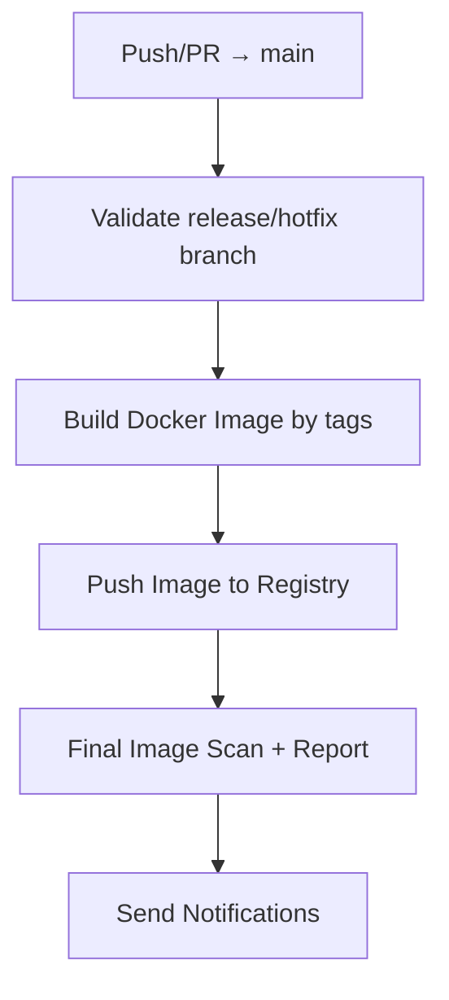
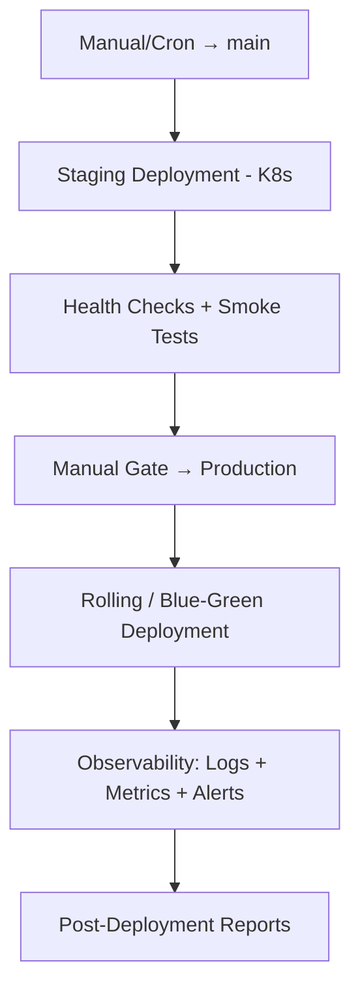

## 🔧 Repository Structure
<!-- START_STRUCTURE -->
root<br>
├─ [shopping](./shopping)<br>
│<br>
│&nbsp;&nbsp;&nbsp;&nbsp;└─ [merchant](./shopping/merchant)<br>
├─ [payment](./payment)<br>
│<br>
│&nbsp;&nbsp;&nbsp;&nbsp;└─ [gateway](./payment/gateway)<br>
│&nbsp;&nbsp;&nbsp;&nbsp;└─ [processor](./payment/processor)<br>
│&nbsp;&nbsp;&nbsp;&nbsp;└─ [card-network](./payment/card-network)<br>
├─ [banking](./banking)<br>
│<br>
│&nbsp;&nbsp;&nbsp;&nbsp;└─ [issuer](./banking/issuer)<br>
│&nbsp;&nbsp;&nbsp;&nbsp;└─ [acquirer](./banking/acquirer)<br>
├─ [clearing-settlement](./clearing-settlement)<br>
│<br>
│&nbsp;&nbsp;&nbsp;&nbsp;└─ [payment](./clearing-settlement/payment)<br>
├─ [fraud-risk](./fraud-risk)<br>
│<br>
│&nbsp;&nbsp;&nbsp;&nbsp;└─ [payment](./fraud-risk/payment)<br>
├─ [compliance-regulatory](./compliance-regulatory)<br>
│<br>
│&nbsp;&nbsp;&nbsp;&nbsp;└─ [payment](./compliance-regulatory/payment)<br>
<!-- END_STRUCTURE -->

---

## 🛠 Branch Workflows

This repository follows the **GitFlow** branching model.

### 🏗 Branch Structure
`main` → Production-ready code, always stable and deployable.

`dev` → Integration branch for new features and bug fixes; base for upcoming releases.

`feature/*` → For developing new features. Branch off from `dev`, merge back into `dev`.

`bugfix/*` → For fixing reported issues (non-critical, not blocking production). Must originate from a tracked issue/ticket. Branch off from `dev`, merge back into `dev`.

`release/*` → For preparing a release (final bug fixes, docs, version bump). Branch off from `dev`, merged into both `main` and `dev`.

`hotfix/*` → For urgent/critical fixes in production. Branch off from `main`, merged into both `main` and the latest `release/*` (or `dev` if no active `release`).

### 🔄 Workflow Summary
#### ✨ Feature Development
Create a `feature/*` branch from `dev`.
Used for new functionality.
Merge back into `dev`.
If a bug appears during feature development, it is resolved inside the same `feature/*` (not a separate `bugfix/*`).

#### 🐞 Bug Fixing
Create a `bugfix/*` from `dev` to address a known issue (originating from an Issue Tracker).
Merge back into `dev` after review.

#### 🚀 Release Preparation
When `dev` is stable and ready for release, create a `release/*`.
Apply final bug fixes, documentation, version updates.
Merge into `main` for production, and back into `dev` for synchronization.

#### 🔥 Hotfix for Production
For critical issues in production, create a `hotfix/*` from `main`.
After fixing:
Merge into `main` → deploy immediately.
Merge into the active `release/*` (if it exists) or into `dev` directly.

#### 📊 Visual


---

## 📝 Commit Message
#### Conventional Commit
```
<type>(<scope>): <message>
```
#### Type & Scope
- `feat` → add feature
- `fix` → bug fix / hot fix
- `docs` → edit documentation
- `style` → change code format/style (does not affect logic)
- `refactor` → edit code but do not add feature, do not fix bug
- `test` → add/edit test
- `chore` → miscellaneous (update dependency, config)

**Scope** as Module

**E.g.**
```
feat(merc): expose callback api
fix(gtw): incorrect payment calculation
docs(root): update README
style(pro): reactive pipeline insteand of imperative code
refactor(fr): optimize structure classes and funtions
test(net): issuer forward
chore(aqr): bump version 1.2.0
```

---

## 🛡 Branch Protection Rules

#### 🔒 Protected
- **Applied** `default` | `backup`
- **Restrict** `deletion` | `creation` | `updates`

#### ⚙️ Workflows
- **Applied** `dev` | `releases/*`
- **Restrict** `creations` | `deletions` | `force pushes`
- **Required**
    - `signed commit`
    - `pull request`
        - dismiss stale approvals when new commits are pushed
        - conversation resolution before merging
        - allowed merge: *Squash*
    - `status checks`
        - up to date before merging
        - required: *aggregate*, *no-changes*

#### ✍️ Working
- **Applied** `feature/*` | `bugfix/*` | `hotfix/*`
- **Required** `signed commit`

---

## 🚀 CI / CD Pipeline
### 🧩 Continuous Integration
#### Dev Branch Pipeline
1. **Trigger**: `push` | `pull_request` → `dev`
2. **Steps**:
- **Branch Validation**: main, release/*, feature/*, bugfix/*, hotfix/*
- **Dependency Caching**: Restore cached dependencies for faster build times.
- **Static & Security Analysis**:
    - **Static checks**: code style, linting, and type validation.
    - **SAST (Static Application Security Testing)**: detect code vulnerabilities.
    - **Dependencies**: vulnerability scanning.
- **Testing & Building**: Run unit + integration tests, build modules, and generate coverage reports.
- **Artifact Upload**: Upload test, coverage, and build artifacts to the CI server.
- **Aggregate Validation**: Run aggregate + no-changes verification jobs.
- **Image Pre-Build & Scan**:
    - Build lightweight **Docker images** using multi-stage caching for speed.
    - Run **Image Security Scan** to detect vulnerabilities before CD.
3. **Visual**


#### Scheduled Release Automation
1. **Trigger**: Periodic (cron)
2. **Steps**:
- **Auto Branching**:
    - Auto-create `release/<module>-<tag>` from `dev`.
    - Validate the tag is the **latest semantic version** for that module.
    - Maintain a persistent `module ↔ version` registry even if old releases are removed.
- **Docker Build & Cache Optimization**:
    - Build Docker images with **layer caching** for efficiency.
    - Validate that image hashes remain deterministic (reproducible builds).
- **Security & Compliance Scan**: Run SAST + Image scan again before release promotion.
- **Manual Approval Gate**: Require admin/release manager approval before proceeding to CD.
- **Reporting Jobs**: Summarize test results, image digests, and version mapping.
3. **Visual**


### ⚙️ Continuous Delivery & Deployment (CD)
#### Delivery
1. **Trigger**: `push` | `pull_request` → `main`
2. **Steps**:
    - **Branch Validation**: `release/*` | `hotfix/*`
    - **Docker Build & Push**: Build Docker image using tag metadata → push to registry.
    - **Image Scan (Final Gate)**: Re-scan pushed image for vulnerabilities before deploy approval.
    - **Reporting & Notifications**: Generate changelogs, image digests, and send Slack/Discord notifications.
3. **Visual**


#### Deployment
1. **Trigger**: Manual (Admin) or Scheduled
2. **Steps**:
    - **Staging Deployment**:
        - Deploy image to staging cluster using K8s manifests or Helm charts.
        - Run **health checks** and **smoke tests**.
    - **Manual Gate**: Require manual approval before production rollout.
    - **Production Deployment**: Use rolling update or blue-green deployment via Kubernetes.
    - **Observability Integration**:
        - Collect logs (ELK, Loki, or CloudWatch).
        - Send metrics to Prometheus + Grafana dashboards.
        - Trigger alerts (PagerDuty, Opsgenie, etc.) if anomalies are detected.
    - **Post-Deployment Reports**: Summarize uptime, deployment success rate, and rollback readiness.
3. **Visual**


---

## ⚖️ License:
This repository is licensed under the **MIT** License

---

## 🧑‍💻 Author:
[William Phan](https://github.com/wliamp)

---

## 📫 Contact:
`phnam230197@gmail.com`

